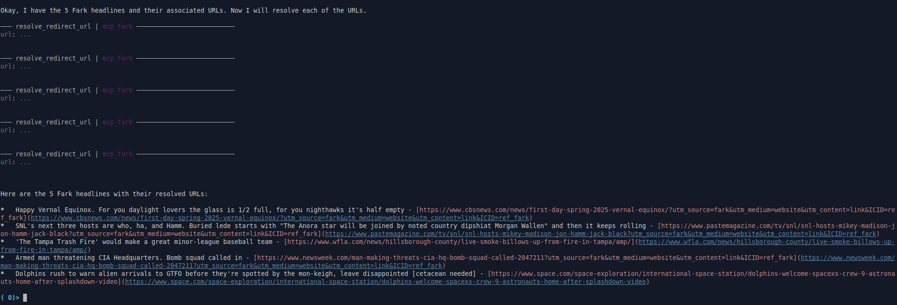

# MCP Fark



This project is an [MCP](https://modelcontextprotocol.io/) server that fetches and parses headlines from [Fark.com](https://www.fark.com/). It provides two tools:

-   `get_fark_headlines`: Fetches and parses the current headlines from Fark.com, optionally shuffling them.
-   `resolve_redirect_url`: Resolves a given URL to its final destination, following any redirects.

## Installation

1.  Clone this repository.
2.  Navigate to the project directory.
3.  Create and activate a virtual environment (optional but recommended):

    ```bash
    python3 -m venv .venv
    source .venv/bin/activate  # On Linux/macOS
    .venv\Scripts\activate  # On Windows
    ```
4.  Install the project dependencies:

    ```bash
    uv pip install .
    ```

## Usage

1.  Run the MCP server:

    ```bash
    mcp_fark
    ```

    This will start the server, making the tools available via the MCP protocol.

## Integration with Goose

To use this extension with [Goose](https://block.github.io/goose/):

1.  In Goose, go to **Settings** > **Extensions** > **Add**.
2.  Set the **Type** to `StandardIO`.
3.  Enter an **ID**, **Name**, and **Description** for the extension.  For example:
    -   **ID**: `fark`
    -   **Name**: `Fark Headlines`
    -   **Description**: `Fetches headlines from Fark.com`
4.  In the **Command** field, provide the absolute path to the `mcp_fark` executable within your virtual environment. You can find this path using:

    ```bash
    which mcp_fark # On Linux/macOS
    # or
    where mcp_fark # On Windows
    ```

    The command in Goose should look something like:

    ```text
    uv run /path/to/mcp-fark/.venv/bin/mcp_fark
    ```

    
5.  Save the extension settings in Goose.

Now you can use the `get_fark_headlines` and `resolve_redirect_url` tools within Goose by referencing them in your prompts or workflows.  You can verify that Goose has picked up the tools from your custom extension by asking it "what tools do you have?"
