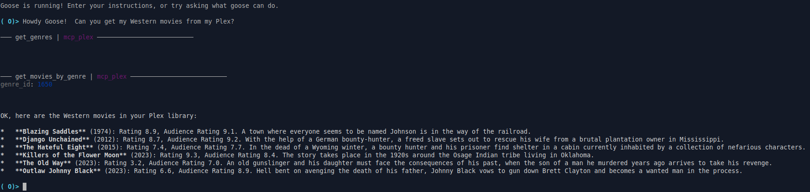

# mcp-plex



An MCP server for interacting with Plex Media Server.

## Overview

This project provides an MCP (Model Context Protocol) server that allows you to interact with your Plex Media Server. It exposes functionalities like retrieving unwatched movies as MCP tools, making it easy to integrate Plex data into applications that support the MCP standard.

## Features

- **Get Unwatched Movies:** Fetches a list of unwatched movies from your Plex library.

## Getting Started

### Prerequisites

- Python 3.12 or higher
- A Plex Media Server
- A Plex API key (PLEX_API_KEY)

### Installation

1.  Clone the repository:

    ```bash
    git clone <repository_url>
    cd mcp-plex
    ```
2.  Create a virtual environment and install the dependencies:

    ```bash
    python -m venv .venv
    source .venv/bin/activate  # On Linux/macOS
    .venv\Scripts\activate  # On Windows
    pip install .
    ```

### Configuration

Set the following environment variables:

-   `PLEX_URL`: The URL of your Plex Media Server (default: `http://plex.lan`).
-   `PLEX_API_KEY`: Your Plex API key.

### Integration with Goose

Similar to the [custom extensions guide](https://block.github.io/goose/docs/tutorials/custom-extensions), you can integrate this MCP server with Goose.

1.  Build the project environment:

    ```bash
    uv sync
    ```

2.  Run the server using `uv run`:

    ```bash
    uv run src/mcp_plex/server.py
    ```

   This will start the MCP server, and you can then add it as an extension in Goose, pointing to the running server.
