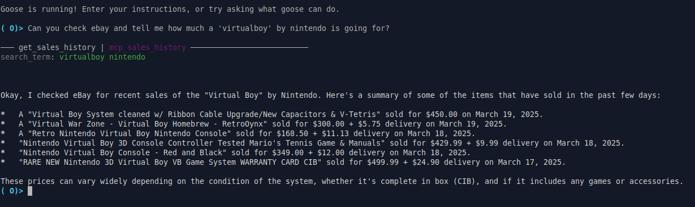

# mcp_sales_history

## Description

This project provides an MCP (Model Context Protocol) server that fetches sales history data from eBay based on a given search term. It allows you to retrieve information about sold items, including their titles, sold dates, selling prices, delivery prices, URLs, and image URLs.

## Features

-   Fetches sales history data from eBay.
-   Extracts relevant information such as item title, sold date, price, and URL.
-   Provides an MCP tool for easy integration with other applications.
-   Uses the `mcp` Python package to create an MCP server.

## Requirements

-   Python 3.12+
-   `beautifulsoup4`
-   `requests`
-   `mcp[cli]`
-   `html2text`

## Installation

1.  Clone the repository:

    ``git clone <repository_url>``

2.  Navigate to the project directory:

    ``cd mcp_sales_history``

3.  Install the dependencies using `uv`:

    ``uv sync``

## Usage

1.  Run the MCP server:

    ``uv run src/mcp_sales_history/server.py``

2.  Alternatively, after publishing the package to pypi, the server can be run directly using `uvx`:

    ``uvx mcp_sales_history``

3.  Use the `get_sales_history` tool with a search term to fetch sales data.

## Integration with Goose

To add this MCP server as an extension in Goose:

1.  Go to Settings > Extensions > Add.
2.  Set the Type to StandardIO.
3.  Provide the ID, name, and description for your extension.
4.  In the Command field, provide the absolute path to your executable. For example:

    ``uv run /full/path/to/mcp_sales_history/.venv/bin/mcp_sales_history``

## MCP Tool

The project exposes the following MCP tool:

-   `get_sales_history(search_term: str) -> str`: Fetches sales history data from eBay for a given search term.

    -   `search_term` (str): The term to search for on eBay.
    -   Returns: A JSON string containing the sales history data.

## Example

To use the `get_sales_history` tool, you can send a request to the MCP server with the desired search term. For example:

``json
{
  "tool_name": "get_sales_history",
  "tool_args": {
    "search_term": "iPhone 13"
  }
}
``

The server will respond with a JSON string containing the sales history data for "iPhone 13".

## License

[Specify the license here, e.g., MIT License]
