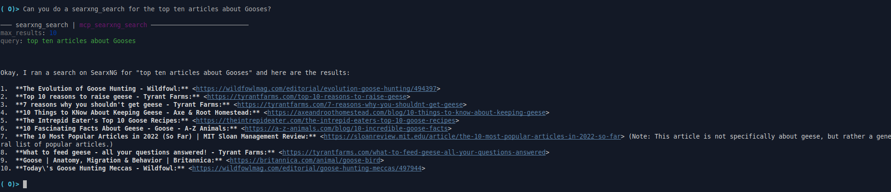

# MCP SearxNG Search



This project provides an [MCP](https://modelcontextprotocol.io/) server that allows you to perform web searches using a [SearxNG](https://github.com/searxng/searxng) instance. It exposes a set of tools that can be called by other MCP-compatible applications, such as Goose.

## Getting Started

1.  Set the `SEARXNG_BASE_URL` environment variable to the base URL of your SearxNG instance.
2.  Install the package: `pip install .`

## Usage with Goose

1.  **Install the extension:** After installing the package, you can add this MCP server as an extension in Goose.
2.  **Add the extension in Goose:** Go to Settings > Extensions > Add.
3.  **Set the extension type:** Set the Type to StandardIO.
4.  **Provide the extension details:** Provide an ID, name, and description for your extension.
5.  **Set the command:** In the Command field, provide the absolute path to your executable using `uv run`. For example:

    ```bash
    uv run /full/path/to/mcp-searxng-search/.venv/bin/mcp-searxng-search
    ```

    Make sure to replace `/full/path/to/mcp-searxng-search` with the actual path to your project directory.

6.  **Using the extension:** Once integrated, you can start using your extension in Goose. Open the Goose chat interface and call your tool as needed. You can verify that Goose has picked up the tools from your custom extension by asking it "what tools do you have?"

### Available Tools

*   **searxng_search**: Searches the web using a SearxNG instance and returns a list of results.
    *   Parameters:
        *   `query` (str, required): The search query.
        *   `max_results` (int, optional): The maximum number of results to return (defaults to 30).
*   **searxng_image_search**: Searches the web for images using a SearxNG instance and returns a list of image results.
    *   Parameters:
        *   `query` (str, required): The search query.
        *   `max_results` (int, optional): The maximum number of results to return (defaults to 30).
*   **fetch_and_clean**: Fetches content from a URL, determines the content type (HTML or PDF), cleans the text, and returns the cleaned text.
    *   Parameters:
        *   `url` (str, required): The URL to fetch and clean.
*   **searxng_news_search**: Searches the web for news articles using a SearxNG instance and returns a list of results.
    *   Parameters:
        *   `query` (str, required): The search query.
        *   `time_range` (str, optional): The time range to filter results by. Valid values are "day", "week", "month", and "year". Defaults to no time limit.
        *   `max_results` (int, optional): The maximum number of results to return (defaults to 30).
*   **searxng_file_search**: Searches for files using a SearxNG instance and returns a list of results, including magnet URIs, seeders, and leechers.
    *   Parameters:
        *   `query` (str, required): The search query.
        *   `time_range` (str, optional): The time range to filter results by. Valid values are "day", "week", "month", and "year". Defaults to no time limit.
        *   `max_results` (int, optional): The maximum number of results to return (defaults to 30).
